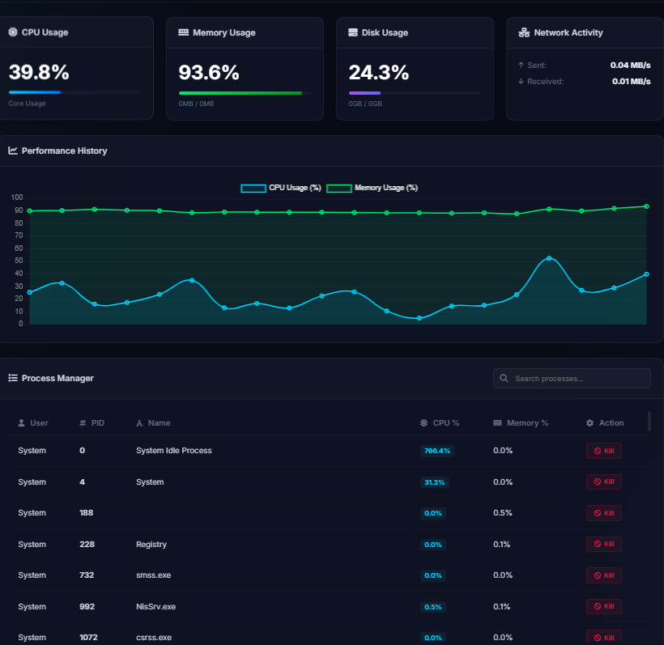

# System Monitor & Dashboard:-
We will build a high-performance, aesthetically stunning web-based dashboard and task manager that runs completely locally on your system. It will display real-time CPU, Memory, Disk, and Network metrics, and allow you to view, filter, sort, and terminate running processes.

# Tech Stack we use:-
- python FastAPI for backend
- app.js and html for frontend 
- css for styling only
# How to run:-
** python -m uvicorn main:app --reload --host [IP_ADDRESS] --port 8000
** Open [http://[IP_ADDRESS]](http://[IP_ADDRESS]) in your browser 
in our system there is 
python -m uvicorn main:app --reload --host 127.0.0.1 --port 8000
